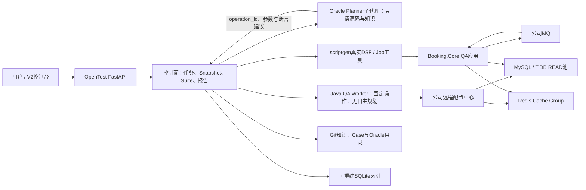

# OpenTest V2 架构总览

## 架构边界

- **Domain**：系统、知识节点与关系、覆盖目标、场景变体、断言和执行记录。
- **Application**：扫描、知识构建、查询、场景编译、执行编排和增量影响分析。
- **Adapters**：scriptgen、Git文件、SQLite、本地Agent、DSF工具与数据源Oracle。
- **API/CLI**：FastAPI和命令行共享同一应用服务。

## OpenTest、分析子代理与QA Worker

子代理不接收凭据、不生成任意SQL、不直连MySQL、TiDB、Redis或MQ。它只能从源码和知识中建议固定 `operation_id`、业务参数和断言。OpenTest校验Snapshot、目录摘要、环境、超时与任务身份后，才把受限请求交给Worker。

Worker不是Agent，没有规划或自由查询能力。每次探测或Case Run使用独立Java进程，通过Booking.Core的QA应用身份加载远程配置；请求只能命中制品内固定操作，响应只有白名单投影、耗时、资源状态和稳定错误码。

## 数据原则

- Markdown/YAML是知识真相源，SQLite只是可重建查询索引。
- 代码事实、推断知识、用户确认和环境观察使用不同可信状态。
- 自动生成区域与人工补充区域分离。
- 所有资产绑定源码基线、知识版本、工具版本、Case版本和Skill版本。

## 单系统扫描数据流

1. `GitSourceRepository` 捕获branch、commit、dirty状态和不泄露正文的dirty摘要。
2. `ScriptgenSourceScanner` 运行真实scriptgen，只从tool manifest接收Facade与Job工具。
3. `JavaStructureScanner` 补充MQ Consumer和 `@State` 状态机；状态机不进入可执行工具集合。
4. `.opentest/tools/<system_id>/<scan_id>` 保存真实生成脚本，`.opentest/scans` 保存结构化manifest。
5. 最近成功基线写入系统 `source.yaml`，后续知识、Case和Snapshot按 `scan_id` 绑定。

## 知识、Case与执行数据流

1. `JavaKnowledgeTracer` 从扫描入口定位Validator、ServiceInvoker、Builder、状态机和数据来源，并输出带行号证据的节点与关系。
2. `KnowledgeGenerationService` 先校验源码基线，再发布自动区、问题批次和关系，最后重建SQLite。
3. `ScenarioGenerationService` 从真实扫描入口的 `request_template` 构造DTO，将业务决策转换为CoverageTarget，并使用约束、边界与pairwise生成有限独立变体；报价结果只进入数据前置条件，不伪装为接口字段。
4. 自然语言先转换为类型化约束；未知、否定或QA模板不足时返回 `missing_conditions`，不补造身份、公司枚举和测试数据。
5. Case和知识发布按 `system_id` 使用跨进程文件锁；增量Case合并未受影响资产，人工变体不会被子集更新误标陈旧。
6. `SnapshotService` 在系统事务锁内绑定源码、知识、当前活跃Case、Skill、工具manifest及实际脚本字节摘要；stale历史Case保留审计但不阻塞新scan，执行前重新校验当前真相没有漂移。
7. `ScenarioExecutionService` 先用本地 `validated_preconditions` 的观察值和证据校验数据前置条件，再从Snapshot解析逻辑工具；inputs/steps/qa变量类型化绑定，通过权限受限临时文件执行真实scriptgen脚本，并保存脱敏的前置条件证据、断言diff和清理证据。
8. Oracle是可直接放入ScenarioStep的类型化动作；DSF、MySQL、Redis和MQ共享有deadline且有最大尝试次数的轮询器，所有观察结果写入本地运行证据。
9. 高影响问题未形成明确口径或内部状态缺少Oracle时，变体生命周期为 `blocked`，禁止产生绿色假通过。

## 安全Oracle与资源状态

1. `SourceResourceDiscoverer` 从Spring XML和Java生产代码发现MySQL、TiDB、Redis、MQ生产者与消费者，只保存逻辑名、配置Key和源码证据。
2. `ResourceInventoryService` 合并静态发现、批准操作数和本地派生状态，页面不返回Host、账号、密码、Token、远程配置原文或SDK堆栈。
3. 数据Oracle统一通过 `QaWorkerOracleAdapter` 调用Java Worker；Python中的旧直连适配器仅保留兼容测试，不注册到Booking.Core生产执行链。
4. Snapshot额外绑定Worker Jar和Oracle目录摘要；任一制品变化都会生成新Snapshot，旧Snapshot执行时被拒绝。
5. 资源探测只能产生 `CONNECTED` 或 `BLOCKED`；Snapshot业务Case的直接Oracle通过后才产生 `READY`。
6. MQ没有轨迹端点时只用明确下游状态作为 `EFFECT_ONLY`，报告不得声称消息传输被直接证明。
7. `cases/custom` 生命周期文档由CaseStore严格编译为统一ScenarioVariant；Fixture引用进入受限QA命名空间，BLOCKED原因不丢失，ready资产必须为每个Oracle提供非空稳定断言。
8. 回归Suite只根据RunRecord中匹配的Oracle步骤、非空断言和观察证据发布资源状态；步骤ID与断言摘要随READY或EFFECT_ONLY证据保存，连接探测不进入资源业务覆盖矩阵。
9. 全局Job必须从Snapshot manifest重读实际工具ID、脚本字节和URL，再用批准只读Oracle统计预计数量、测试订单和非本轮订单并签发五分钟一次性Token；QA环境、脚本摘要和URL任一漂移都会在Runner前拒绝。

scriptgen工具ID先规范为逻辑ID，例如 `facade.trade.create_order`。场景只引用逻辑ID，传输URL和生成脚本路径属于工具版本元数据。

## 扩展原则

- 一期只实现一个系统，但所有节点保留稳定 `system_id`。
- 场景引用逻辑工具和Oracle，不直接绑定HTTP、RPC或浏览器传输。
- 后续HTTP与Web能力通过新增扫描器、Executor和Oracle扩展，不改变核心场景模型。
